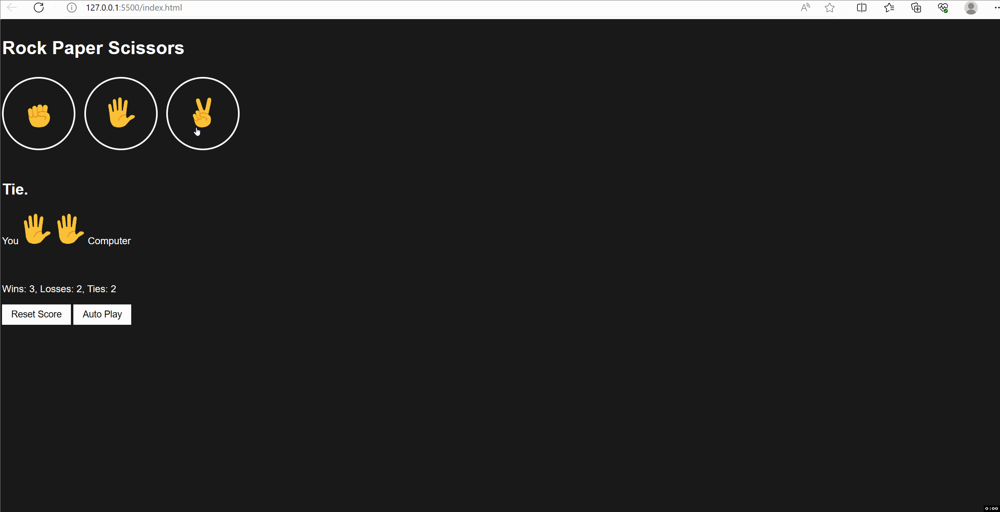
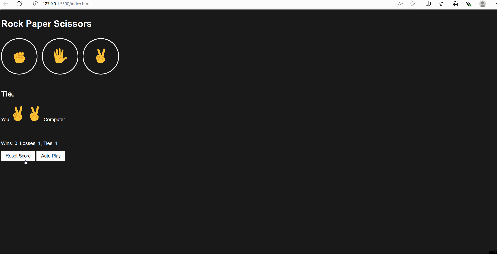
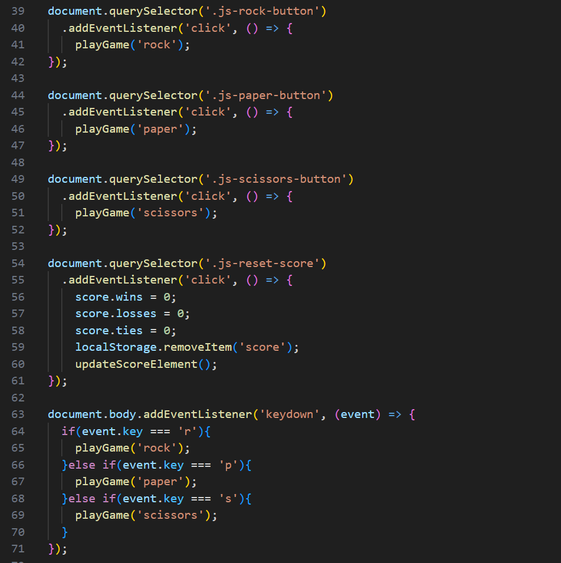
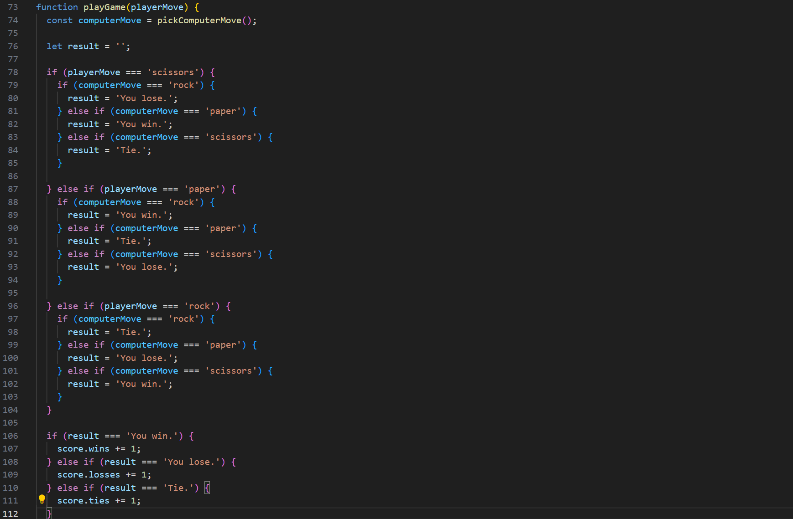
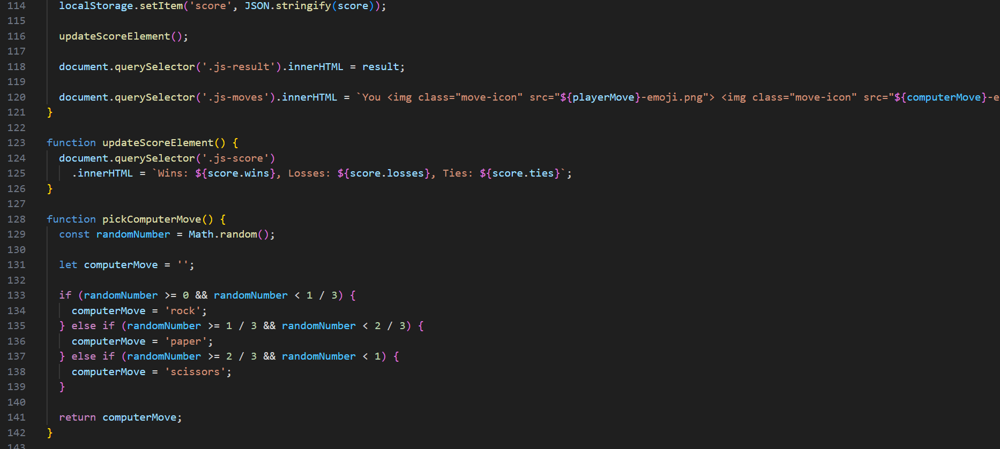
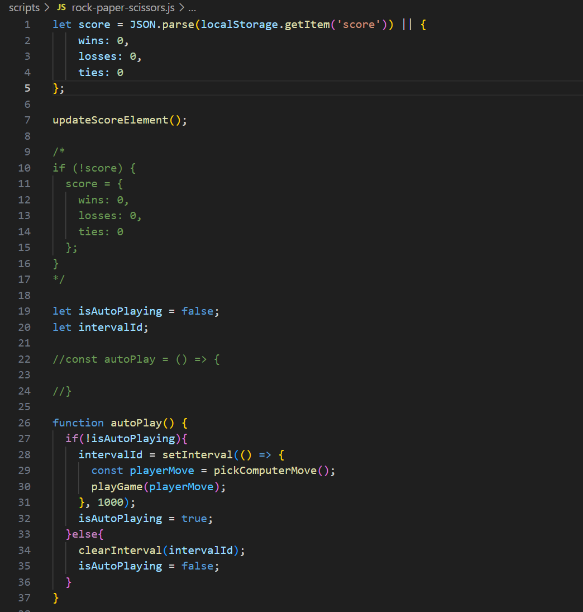

# Rock Paper Scissors Game

A game coded in HTML, CSS, and Javascript where the user plays against the computer in rock paper scissors. The user can select one of the three buttons with the emojis or press the corresponding keys ('r' for rock, 'p' for paper, and 's' for scissors) and depending on what the user picks, the computer will pick a random move. Each round, the score will be updated with a win, loss, or a tie. The user can reset the score at any time by pressing the reset score button. 

The user has the option to have the game automatically play so that the moves will be chosen automatically at random by the computer. If the user leaves the game and opens the game again, the score will be stored in their local machine and the score will be kept from when the user last logged off. 

The technical concepts this website demonstrates are storing the score as a JSON string in the local storage and retrieving it as an object to maintain the score even when the user leaves the game, and having the Javascript code read which move is made by the player not in auto play mode to compare to the computer's randomly selected move and display the appropriate result.

# Core Technical Concepts

The code listens for a 'click' event from the rock, paper, and scissors buttons (or the 'r', 'p', and 's' 'keydown' events) and calls the function playGame passing down the corresponding string to that function depending on which button or key was pressed.

The playGame function takes the input from the user and calls the pickComputerMove function which generates a random number from 0 - 1 and picks a move depending on the number generated in which the pickComputerMove function returns a string.

Depending on the playerMove string variable, it is compared to the computerMove variable to determine which result the round ends in for the user and updating the score.

The score is stored as a JSON string and in the user's local machine by using this line of code 

localStorage.setItem(&#39;score&#39;, JSON.stringify(score));

The score gets updated and displayed on the html document body and shows the move made by both the user and the computer. 

Two variable, isAutoPlaying and intervalID are set to false since the user can't set the game to auto play mode when the user first opens the game. The auto play button needs to be pressed for auto play to activate, meaning the function autoPlay gets called whenever the auto play button gets clicked on. If isAutoPlaying equals not false (if the game is in auto play mode), the variable intervalID gets set to run a function where the playerMove variable is generated by the computer, and passes that variable onto the playGame function. This action is repeated every 1000 milliseconds. The variable isAutoPlaying is set to true because the game is now being played in auto mode. If isAutoPlaying equals false (if the game isn't in auto play mode), intervalID gets cleared to stop the function from repeating after auto play mode is off and isAutoPlaying is set to false again since we are not playing the game in auto mode. 

## Getting Started/Requirements

To run this website, download the code from [github.com/JCV2022/About-Me-Website](https://github.com/JCV2022/About-Me-Website)

A code editor program is needed. Any should do fine, I used Visual Studio Code to code my website.

If you do use Visual Studio Code as your code editor, install the extension Live Server to be able to run the code in real-time. After installing this extension, right click the code and click on 'open live server'. You can then see the changes you make to the code live whenever you save and view those changes on the browser the code shows up on.

If node.js isn't installed on your machine, download the LTS version through this link [nodejs.org/en](https://nodejs.org/en) and run the installation.exe file.

Git was used for this project. Go to [git-scm.com/downloads](https://git-scm.com/downloads) and download git for your respective device. After downloading the file and running the installation exe found in your downloads folder, open Visual Studio Code and click on source control on the left hand bar with the project still open and click on 'initialize repository'. This allows you to keep track of changes you make to the code and also lets you push code to the GitHub repository without having to updating the repository manually. 

## Contact Info

My email address is vujonathan00@gmail.com

My github is github.com/JCV2022

My linkedIn is linkedin.com/in/jonathan-vu-409a71132/
